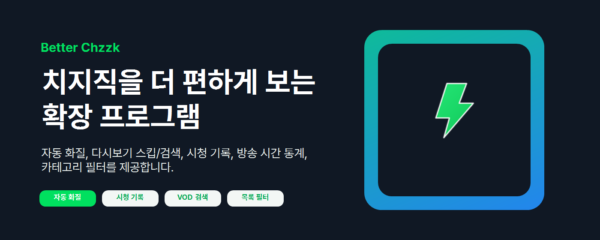

# Better Chzzk

> 치지직(CHZZK) 시청과 탐색을 더 편하게 만들어 주는 비공식 Chrome 확장 프로그램입니다.



**Better Chzzk**는 자동 화질 복구, 그리드 우회, 통나무 보상 자동 받기, 단축키 복구, 다시보기 스킵/검색, 채팅 도구, 팔로잉 라이브 미리보기, 방송 목록 필터, 채널 방송 시간 통계, 라이브 시청 기록, 광고 차단 안내 팝업 숨김 등의 기능을 한곳에 모은 확장 프로그램입니다. 대부분의 기능은 설정 화면에서 개별로 켜고 끌 수 있으며, 세부 수치까지 직접 조절할 수 있습니다.

- **버전:** 1.3.0
- **플랫폼:** Chrome (Manifest V3)
- **대상 사이트:** `https://chzzk.naver.com/*`
- **언어:** 한국어

---

## 목차

- [기능 한눈에 보기](#기능-한눈에-보기)
- [설치 방법](#설치-방법)
- [빠른 시작](#빠른-시작)
- [기능 상세](#기능-상세)
    - [1. 자동 화질 복구와 그리드 우회](#1-자동-화질-복구와-그리드-우회)
    - [2. 스킵과 시간 이동](#2-스킵과-시간-이동)
    - [3. 볼륨 조절과 오디오 컴프레서](#3-볼륨-조절과-오디오-컴프레서)
    - [4. 단축키 복구](#4-단축키-복구)
    - [5. 다시보기 방송시각 표시](#5-다시보기-방송시각-표시)
    - [6. 타임머신 지연 표시](#6-타임머신-지연-표시)
    - [7. 다시보기 채팅 복구](#7-다시보기-채팅-복구)
    - [8. 채팅 도구](#8-채팅-도구)
    - [9. 통나무 보상 자동 받기](#9-통나무-보상-자동-받기)
    - [10. 팔로잉 사이드바](#10-팔로잉-사이드바)
    - [11. 방송 목록 도구](#11-방송-목록-도구)
    - [12. 긴 제목 툴팁](#12-긴-제목-툴팁)
    - [13. 다시보기 검색](#13-다시보기-검색)
    - [14. 채널 방송 시간 통계](#14-채널-방송-시간-통계)
    - [15. 라이브 시청 기록](#15-라이브-시청-기록)
    - [16. 광고 차단 안내 팝업 숨김](#16-광고-차단-안내-팝업-숨김)
- [시청 기록 페이지](#시청-기록-페이지)
- [조작 방법 요약 (키보드·마우스)](#조작-방법-요약-키보드마우스)
- [설정 항목 전체 표](#설정-항목-전체-표)
- [기능이 동작하는 페이지](#기능이-동작하는-페이지)
- [권한 및 개인정보](#권한-및-개인정보)
- [문제 해결](#문제-해결)
- [개발](#개발)
- [고지](#고지)

---

## 기능 한눈에 보기

| 기능                                                       | 하는 일                                                        | 기본값 |
| ---------------------------------------------------------- | -------------------------------------------------------------- | ------ |
| [자동 화질 복구](#1-자동-화질-복구와-그리드-우회)          | 1080p를 우선 적용하고, 화질이 떨어지면 가능한 화질로 복구      | 켜짐   |
| [그리드 우회](#1-자동-화질-복구와-그리드-우회)             | 라이브의 공식 직접 HLS로 고화질을 재생해 그리드 설치를 건너뜀  | 켜짐   |
| [스킵과 시간 이동](#2-스킵과-시간-이동)                    | 방향키·스킵 버튼으로 시간 이동, 라이브 위치 유지               | 켜짐   |
| [Space 홀드 2배속](#2-스킵과-시간-이동)                    | Space를 길게 누르는 동안 라이브·다시보기를 2배속으로 재생      | 켜짐   |
| [재생 배속 단축키](#2-스킵과-시간-이동)                    | 라이브·다시보기에서 `[`는 0.5배속, `]`는 2배속으로 설정        | 켜짐   |
| [볼륨 휠 조절](#3-볼륨-조절과-오디오-컴프레서)             | 볼륨 영역에서 마우스 휠로 볼륨 조절                            | 켜짐   |
| [볼륨 툴팁](#3-볼륨-조절과-오디오-컴프레서)                | 볼륨 슬라이더 호버 시 현재 볼륨 표시                           | 꺼짐   |
| [플레이어 오디오 컴프레서](#3-볼륨-조절과-오디오-컴프레서) | 볼륨 컨트롤에 음량 압축 토글 버튼 추가                         | 꺼짐   |
| [재생 단축키 복구](#4-단축키-복구)                         | 멈춘 치지직 기본 단축키(스페이스, `m`, `f`, `t`)를 자동 보조   | 항상   |
| [다시보기 방송시각 표시](#5-다시보기-방송시각-표시)        | 지금 보는 장면이 실제로 방송된 시각을 표시                     | 꺼짐   |
| [타임머신 지연 표시](#6-타임머신-지연-표시)                | 라이브 되감기 중 실시간 대비 지연 시간 표시                    | 켜짐   |
| [다시보기 채팅 복구](#7-다시보기-채팅-복구)                | 채팅 다시보기가 빠진 다시보기를 한 번만 자동 새로고침          | 항상   |
| [다시보기 채팅창 댓글 탭](#7-다시보기-채팅-복구)           | 채팅 유무와 관계없이 우측에서 댓글과 타임코드를 바로 표시      | 켜짐   |
| [타임스탬프 표시](#8-채팅-도구)                            | 라이브 채팅의 서버 작성 시각을 닉네임 왼쪽에 표시              | 꺼짐   |
| [채팅방 환영 메시지 제거](#8-채팅-도구)                    | 채팅을 다시 불러올 때 나타나는 환영·필터링 안내 메시지를 숨김  | 꺼짐   |
| [블라인드 채팅 원문 표시](#8-채팅-도구)                    | 확인할 수 있는 블라인드 채팅 원문 표시                         | 꺼짐   |
| [방송자·운영자 채팅 모아보기](#8-채팅-도구)                | 방송자/채팅 운영자 채팅을 별도 패널에 모아보기                 | 꺼짐   |
| [통나무 보상 자동 받기](#9-통나무-보상-자동-받기)          | 1시간 수령 버튼과 대기 중인 통나무 claim을 자동 처리           | 켜짐   |
| [사이드바 치즈팜 숨김](#10-팔로잉-사이드바)                | 사이드바의 치즈팜 메뉴만 선택적으로 숨김                       | 꺼짐   |
| [팔로잉 채널 고정](#10-팔로잉-사이드바)                    | 고정 채널을 라이브·오프라인 그룹 상단에 표시                   | 켜짐   |
| [팔로잉 라이브 제목 이력](#10-팔로잉-사이드바)             | 팔로잉 본문의 현재 라이브 제목 변경 이력을 펼쳐봄              | 켜짐   |
| [팔로잉 자동 새로고침](#10-팔로잉-사이드바)                | 사이드바 팔로잉 라이브 상태를 주기적으로 갱신                  | 켜짐   |
| [방송 목록 호버 미리보기](#10-팔로잉-사이드바)             | 팔로잉·방송 목록 카드에서 라이브 미리보기 재생                 | 꺼짐   |
| [방송 목록 검색·필터](#11-방송-목록-도구)                  | 라이브·영상·클립 목록에 검색창·필터·부가 정보 추가             | 켜짐   |
| [긴 제목 툴팁](#12-긴-제목-툴팁)                           | 말줄임된 방송·영상 제목 전체를 툴팁으로 표시                   | 켜짐   |
| [다시보기 검색](#13-다시보기-검색)                         | 채널 다시보기를 제목·댓글 내용으로 검색                        | 켜짐   |
| [채널 방송 시간 통계](#14-채널-방송-시간-통계)             | 채널 홈에 최근 평균 방송 시간과 월간 방송 달력 표시            | 켜짐   |
| [라이브 시청 기록](#15-라이브-시청-기록)                   | 라이브 시청 시간을 이 브라우저에만 기록하고 달력·목록으로 조회 | 켜짐   |
| [광고 차단 안내 팝업 숨김](#16-광고-차단-안내-팝업-숨김)   | 광고 차단 안내 팝업과 어두운 배경을 숨김                       | 켜짐   |

---

## 설치 방법

이 확장 프로그램은 소스에서 직접 설치(개발자 모드)할 수 있습니다.

1. 이 저장소를 내려받거나 클론합니다.
    ```bash
    git clone <repository-url>
    ```
2. Chrome 주소창에 `chrome://extensions` 를 입력해 확장 프로그램 페이지를 엽니다.
3. 오른쪽 위의 **개발자 모드**를 켭니다.
4. **압축해제된 확장 프로그램을 로드합니다** 버튼을 누르고, 내려받은 폴더(`manifest.json`이 있는 위치)를 선택합니다.
5. 설치가 끝나면 툴바에 Better Chzzk 아이콘이 나타납니다.

> 빌드 과정은 필요 없습니다. 이 저장소는 번들러 없이 그대로 로드되는 순수 확장 프로그램입니다.

---

## 빠른 시작

- **설정 열기:** 툴바의 Better Chzzk 아이콘을 클릭하면 설정 팝업(`options.html`)이 열립니다. `chrome://extensions`의 확장 프로그램 세부정보 → **확장 프로그램 옵션**으로도 열 수 있습니다.
- **기능 켜고 끄기:** 카테고리 탭을 고른 뒤 관련 기능 묶음을 펼쳐 토글 스위치로 켜고 끕니다. 일부 세부 옵션은 상위 기능이 켜져 있을 때만 활성화됩니다.
- **설정 찾기:** 상단 검색창에서 기능명이나 수치 이름을 찾으면 관련 묶음이 자동으로 펼쳐집니다. 좁은 빠른 조작 팝업에서는 탭이 아이콘 한 줄로 표시됩니다.
- **세부 수치 조절:** 관련 기능 묶음 안에서 스킵 초, 조회 페이지 수, 필터 기준값 등을 직접 입력할 수 있습니다.
- **저장:** 값을 바꾸면 상단에 `변경됨` 상태가 표시됩니다. `옵션 저장` 버튼을 눌러 변경 사항을 적용합니다.
- **초기화:** **기본값 복원** 버튼을 누르면 모든 설정이 기본값으로 되돌아갑니다.
- **적용 시점:** 대부분의 설정은 열려 있는 치지직 탭에 새로고침 없이 곧바로 반영됩니다. `그리드 우회`는 다음 라이브 진입이나 새로고침부터 적용됩니다.

---

## 기능 상세

### 1. 자동 화질 복구와 그리드 우회

라이브와 다시보기에 입장할 때 **1080p를 우선 적용**합니다. 1080p가 없으면 가능한 가장 높은 하위 화질을 선택하고, 시청 도중 화질이 떨어지면 같은 기준으로 복구를 시도합니다.

- 입장 직후, 페이지 전환 직후, 그리고 플레이어가 화질을 낮췄을 때 자동으로 다시 적용합니다.
- `그리드 우회`를 켜면 라이브 재생 응답에서 치지직이 그리드 전용으로 표시한 P2P 경로 정보와 활성 메타데이터를 제거하고, 같은 응답의 공식 직접 HLS master를 사용합니다. 별도 플레이어나 외부 재생 경로를 만들지 않습니다.
- 2026-08-13에 실측한 공식 CDN 호스트 3종의 HTTPS HLS/LL-HLS 형식에만 적용하며, 다른 호스트나 재생 형식은 원본 상태로 둡니다. 설정 변경은 다음 라이브 진입이나 새로고침부터 반영됩니다.
- 관련 설정: `자동 화질 복구`, `그리드 우회`(기본값: 모두 켜짐).

### 2. 스킵과 시간 이동

다시보기와 라이브 타임머신에서 설정한 시간만큼 앞뒤로 이동할 수 있는 도구를 제공합니다.

- **방향키 스킵:** `←` / `→` 방향키로 설정한 **기본 스킵** 시간만큼 뒤로/앞으로 이동합니다. 라이브에서는 현재 플레이어가 제공하는 타임머신 범위 안에서 동작합니다. (입력창에 포커스가 있을 때나 Ctrl·Alt·⌘ 조합일 때는 동작하지 않습니다.)
- **플레이어 버튼(스킵 알약):** 플레이어의 시간 표시 옆에 현재 스킵 초가 적힌 작은 버튼이 붙습니다.
    - **마우스 휠**로 스킵 초를 늘리거나 줄입니다. 기본 휠은 **휠 기본** 단위, `Shift`+휠은 **Shift+휠** 단위, `Alt`+휠은 **Alt+휠** 단위로 조절됩니다.
    - 버튼을 **클릭**하면 스킵 초가 기본값으로 초기화됩니다.
- **라이브 플레이어 버튼:** 라이브와 타임머신에서도 스킵 버튼을 표시합니다. 라이브 컨트롤에는 플레이어가 제공하는 실제 라이브 끝 지점으로 이동하는 **빨리 감기** 버튼도 함께 제공됩니다.
- **라이브 위치 유지:** 켜면 일시정지 또는 타임머신 시청 중 치지직이 실시간 위치로 강제 복귀시키는 동작을 줄입니다. 끄면 치지직 기본 동작대로 실시간 위치로 이동합니다.
- **Space 홀드 2배속:** 라이브와 다시보기에서 Space를 짧게 누르면 재생/일시정지를 한 번 전환하고, 길게 누르면 누르는 동안만 2배속으로 재생한 뒤 원래 배속으로 돌아옵니다. 입력창·실제 버튼에서는 개입하지 않습니다.
- **재생 배속 단축키:** 라이브와 다시보기에서 `[`를 누르면 0.5배속, `]`를 누르면 2배속으로 고정합니다. 적용된 키를 한 번 더 누르면 1배속으로 돌아옵니다. 설정에서 기능을 따로 끄거나 두 키를 원하는 키로 바꿀 수 있으며, 입력창·실제 버튼과 기존 재생 조작에 쓰이는 키는 가로채지 않습니다.
- 관련 설정: `다시보기·타임머신 스킵`, `방향키·프레임 이동`, `스킵 버튼 표시`, `라이브에도 스킵 버튼 표시`, `일시정지 중 실시간 복귀 방지`, `Space 홀드 2배속`, `0.5·2배속 단축키`와 두 배속 키, 그리고 `기본 스킵`/`휠 기본`/`Shift+휠`/`Alt+휠` 수치.

### 3. 볼륨 조절과 오디오 컴프레서

플레이어 볼륨 컨트롤 주변에서 쓰는 세 가지 보조 기능입니다.

- **볼륨 휠 조절:** 볼륨 영역에서 마우스 휠로 볼륨을 올리거나 내립니다. 휠 1틱당 변화량은 직접 조절할 수 있습니다.
- **볼륨 툴팁:** 볼륨 슬라이더에 마우스를 올리면 현재 볼륨을 치지직 컨트롤과 어울리는 툴팁으로 표시합니다.
- **오디오 컴프레서:** 옵션을 켜면 볼륨 컨트롤에 컴프레서 버튼을 표시합니다. 버튼을 눌러 실제 압축 적용 여부를 전환하며, 마지막 선택은 이 브라우저에 저장되어 새로고침·페이지 이동·브라우저 재시작 뒤에도 유지됩니다. 옵션을 끄거나 치즈나이프(cheese-knife) 확장의 컴프레서가 감지되면 충돌을 피하기 위해 Better Chzzk의 버튼과 압축 적용만 일시적으로 해제하며, 마지막 선택 자체는 바꾸지 않습니다.
- 관련 설정: `휠로 볼륨 조절`, `1틱 볼륨`, `볼륨 % 표시`, `컴프레서 버튼 표시`와 압축 세부 수치(임계값·무릎·비율·어택·릴리즈·보정 게인).

### 4. 단축키 복구

List-KR 필터 환경 등에서 치지직 기본 단축키가 멈춘 것으로 감지되면 스페이스, `m`, `f`, `t` 입력을 플레이어 컨트롤 버튼 클릭으로 대신 처리합니다.

- 스페이스, `m`, `f`는 먼저 기본 동작 여부를 짧게 확인하고, `t`(넓은 화면)는 상태 판정이 어려워 확장이 즉시 보조할 수 있습니다.
- 별도 설정 없이 자동으로 동작합니다. 자세한 배경은 [문제 해결](#문제-해결)을 참고하세요.

### 5. 다시보기 방송시각 표시

다시보기에서 방송 시작 시각과 현재 재생 위치를 더해, 지금 보고 있는 장면이 **실제로 방송된 시각**을 표시합니다. 방송 제목 옆에는 지난 방송 제목을 모아 보는 패널도 함께 제공됩니다.

- 17시간 제한으로 여러 다시보기로 나뉜 방송은 연결된 이전 세그먼트의 길이까지 이어 계산해, 현재 장면의 실제 방송 시각을 표시합니다.
- 방송 시작 시각을 확인할 수 없는 다시보기에서는 표시가 나타나지 않습니다.
- 관련 설정: `다시보기 방송시각`(기본값: 꺼짐).

### 6. 타임머신 지연 표시

라이브 타임머신으로 과거 구간을 볼 때, 실시간 방송과 비교한 **지연 시간**을 표시합니다.

- 관련 설정: `타임머신 지연 표시`.

### 7. 다시보기 채팅 복구

SPA(페이지 내 이동)로 다시보기에 들어갔을 때 "라이브 채팅 다시보기"가 빠지는 경우, 해당 다시보기를 **한 번만 자동 새로고침**해 채팅을 복구합니다.

- 같은 다시보기에서 반복 새로고침되지 않도록 짧은 시간 동안 중복을 방지합니다.
- 채팅 복구는 별도 설정 없이 기본으로 작동합니다.
- **다시보기 채팅창 댓글 탭:** 우측의 `라이브 채팅 다시보기` 디자인은 유지하면서 옆에 `댓글` 탭을 추가합니다. 채팅 다시보기가 없는 VOD에서는 같은 위치와 탭 디자인으로 댓글 전용 패널을 바로 표시하며, 전체화면이나 채팅 접기로 네이티브 패널이 잠시 사라진 상태에서는 별도 댓글창을 띄우지 않습니다. VOD 화면이 유휴 상태일 때 치지직 댓글 API에서 첫 10개를 미리 받아 두고, 댓글 탭을 열면 같은 결과를 바로 표시합니다. 패널을 내리면 모바일 웹 방식의 다음 offset을 사용해 이어 붙입니다. 원본과 같은 인기순(기본)·최신순·등록순과 새로고침을 지원하고, 작성자·시각·본문·답글·타임코드·첨부 이미지를 우측 폭에 맞춰 표시합니다. 긴 글은 `더보기`로 펼치고 다시 접을 수 있습니다. 답글은 원본처럼 기본으로 접혀 있으며 `답글 N` 문구는 유지한 채 화살표 방향으로 펼침 상태를 표시합니다. 펼친 답글은 22px 프로필과 좁은 들여쓰기를 사용하고 본문 앞에 답글 대상 이름을 표시합니다. 원본 댓글의 작성자·날짜·본문 글꼴 값을 반영하고 라이트·다크 색상 토큰을 따릅니다. 같은 하단 원본 댓글의 타임코드 버튼을 확인할 수 있으면 그 버튼의 표시 시각과 이동 동작을 그대로 사용하고, 원본 버튼이 없을 때만 현재 영상에서 직접 이동합니다. 하단 원본 댓글에서 같은 댓글의 컨트롤을 확인할 수 있을 때는 우측 아바타와 작성자 이름을 각각 대응하는 원본 프로필 버튼에 연결합니다. 버프 버튼도 원본 동작을 한 번 호출하며, 원본의 일시적인 초록색 버튼·숫자 상태와 증가한 개수를 그대로 동기화합니다. 원본 컨트롤이 없거나 비활성 상태이면 우측 버튼도 이유 안내와 함께 비활성화하며, 댓글 작성·삭제·신고는 하단 원본 댓글에서만 사용합니다.
- 관련 설정: `다시보기 채팅창 댓글 탭`.

### 8. 채팅 도구

`타임스탬프 표시`를 켜면 라이브 채팅의 닉네임 왼쪽과 방송자/채팅 운영자 모아보기에 **서버 메시지에 기록된 실제 작성 시각**을 브라우저 현지 `HH:MM` 형식으로 표시합니다. 입장·스크롤·재연결 때 서버에서 불러온 기존 채팅도 원본 시각을 사용하며, 유효한 서버 시각을 확인할 수 없는 행에는 현재 시각을 대신 붙이지 않습니다. 기본값은 꺼짐입니다.

`채팅방 환영 메시지 제거`를 켜면 라이브 채팅을 처음 열거나 다시 불러올 때 표시되는 “채팅방에 오신 것을 환영합니다!” 환영 행과 “쾌적한 시청 환경을 위해 일부 메시지는 필터링 됩니다.” 안내 행을 함께 숨깁니다. 기본값은 꺼짐입니다.

라이브 채팅에서 블라인드 처리된 메시지의 원문을 확인하고, 채팅창 우측 상단 아이콘에서 방송자/채팅 운영자 채팅을 모아 볼 수 있습니다. 두 기능은 각각 독립적으로 켜며 기본값은 모두 꺼짐입니다.

- **블라인드 채팅 원문 표시:** 확인할 수 있는 원문만 채팅 아래에 보여 줍니다. 원문이 없으면 `[블라인드 메시지: 원문 없음]` 안내 문구만 표시하고 내용을 만들어 내지 않습니다.
- **방송자/채팅 운영자 모아보기:** 방송자나 채팅 운영자(구 매니저)로 확인되는 채팅만 채팅창 우측 상단 아이콘에서 여는 패널에 모읍니다.
- 모아 둔 채팅 메시지는 현재 페이지에서만 유지되며 새로고침하면 사라집니다.
- 서버 권한을 우회하거나, 비공개 moderation API를 호출하거나, 페이지가 이미 사용하지 않는 엔드포인트에서 삭제/숨김 메시지를 가져오지 않습니다.
- 관련 설정: `타임스탬프 표시`, `채팅방 환영 메시지 제거`, `블라인드 채팅 원문 표시`, `방송자·운영자 채팅 모아보기`(기본값: 모두 꺼짐), `모아보기 보관 개수`.

### 9. 통나무 보상 자동 받기

시청 중 치지직 페이지가 **통나무 보상 받기** 또는 **1시간 라이브 시청 후 인증하기** 버튼을 실제로 표시하면, 잠시 뒤 버튼 상태를 다시 확인하고 보상 상태별로 한 번만 클릭합니다. 같은 보상의 버튼이 재렌더되더라도 중복 클릭하지 않으며, 다음 보상 상태나 다른 방송의 보상은 새로 수집합니다. 또한 라이브 채널의 통나무 claim 목록을 30초마다 확인해 팔로우 등 대기 중인 비시청 보상을 자동으로 받습니다. 이 기능은 기본값이 켜짐입니다.

프로필 팝업의 **보유 파워**와 **통나무 파워 획득 방법** 목록은 수령 버튼이 아니므로 자동 클릭하지 않습니다. 이 목록은 보상을 받은 뒤에도 그대로 남습니다.

- 시청 시간을 조작하거나 서버 확인을 우회하지 않습니다.
- `WATCH_1_HOUR` 보상은 API로 직접 수령하지 않고 치지직이 표시한 화면 버튼으로만 받습니다.
- 그 외 치지직이 claim 목록으로 제공한 보상은 로그인 세션을 사용해 치지직 `log-power` API로 받으며, 성공한 claim ID는 중복 요청하지 않습니다.
- `통나무` 또는 `1시간 라이브 시청 후 인증하기`처럼 확인된 통나무 보상 문구가 있는 버튼만 감지하며, 일반적인 `받기`나 `인증하기` 버튼은 클릭하지 않습니다.
- 관련 설정: `통나무 보상 자동 받기`(기본값: 켜짐).

### 10. 팔로잉 사이드바

팔로잉 본문과 사이드바에서 라이브를 더 빠르게 확인할 수 있게 합니다.

- **사이드바 치즈팜 숨김:** 사이드바의 치즈팜 메뉴만 숨깁니다. 헤더의 치즈 아이콘과 치즈팜 페이지 자체는 그대로 유지합니다.
- **팔로잉 채널 고정:** 사이드바 팔로잉 헤더에서 새로고침 왼쪽의 핀 버튼으로 고정 모드를 켠 뒤 채널을 선택해 고정하거나 해제합니다. 고정된 채널은 채널명 오른쪽에 작은 핀 아이콘을 항상 표시하고, 고정 모드에서만 행에 어두운 초록색 테두리를 표시합니다. 기본 순서는 고정 라이브 → 일반 라이브 → 고정 오프라인 → 일반 오프라인입니다. `오프라인이어도 최상단 고정`을 켜면 방송 여부와 관계없이 고정 채널을 일반 라이브보다 위에 모읍니다. 이 옵션의 기본값은 꺼짐이며, 같은 그룹 안에서는 치지직이 제공한 상대 순서를 유지합니다. 고정 목록과 설정은 Chrome 동기화 설정에 저장합니다.
- **팔로잉 라이브 제목 이력:** 팔로잉(`/following`) 본문에 현재 라이브 중인 방송의 제목을 방송별로 이 브라우저에만 저장합니다. 제목이 바뀌면 현재 제목 오른쪽 버튼으로 이전 제목과 확인 시각을 펼쳐 볼 수 있으며, 같은 채널의 다음 방송은 새 라이브 ID를 확인해 이력을 새로 시작합니다.
- **팔로잉 목록 자동 새로고침:** 사이드바 팔로잉 채널의 라이브 상태를 설정한 주기마다 갱신하며, 다른 탭을 오래 본 뒤 돌아오면 즉시 한 번 갱신합니다.
- **팔로잉 호버 미리보기:** 사이드바 팔로잉 라이브에 마우스를 올리면 `live-detail` 메타데이터와 탐색 hover와 같은 `auto-play-info` HLS 정보를 받아 카드 안에서 미리보기를 재생합니다. 자동 재생 정보에 사용할 수 있는 HLS가 없으면 `live-detail`의 정상 재생 정보를 사용합니다. 미리보기 소리는 설정한 고정 볼륨(기본 15%)을 사용하며, 브라우저가 소리 자동재생을 막으면 음소거로 먼저 재생한 뒤 카드 안 버튼으로 소리를 켤 수 있습니다. `우클릭으로 미리보기 소리 전환`을 켜면 영상 좌측 하단의 작은 스피커 아이콘으로 현재 상태를 표시하고, 우클릭할 때 `소리 켜짐` 또는 `소리 꺼짐` 문구가 옆으로 펼쳐졌다가 다시 아이콘으로 접힙니다. 진행 시간은 `00:00:00` 형식으로 표시하고, 새 창이나 외부 프레임으로의 대체 재생은 사용하지 않습니다.
- 관련 설정: `사이드바 치즈팜 숨김`(기본값: 꺼짐), `팔로잉 채널 고정`, `오프라인이어도 최상단 고정`(기본값: 꺼짐), `팔로잉 라이브 제목 이력`, `팔로잉 목록 자동 새로고침`, `자동 새로고침 주기`, `방송 목록 호버 미리보기`(기본값: 꺼짐), `호버 미리보기 소리`, `미리보기 볼륨`, `우클릭으로 미리보기 소리 전환`.

> 치지직이 화면에 생성한 채널 행의 표시 순서만 바꾸며 기존 목록 UI는 유지합니다. 접힌 목록에 아직 생성되지 않은 고정 채널은 `더보기`로 목록을 펼쳐야 정렬에 반영됩니다.

> `방송 목록 호버 미리보기`를 켜면 미리보기 영상을 불러오는 `pstatic.net` 호스트 권한을 그 시점에 요청합니다. [권한 및 개인정보](#권한-및-개인정보)를 참고하세요.

### 11. 방송 목록 도구

전체 방송(`/lives`)과 카테고리의 라이브·영상·클립 목록 위에 **검색창 · 결과 수 표시 · 필터 메뉴**를 추가하고, 각 카드에 팔로워 수와 목록에 맞는 부가 정보를 더합니다.

- **현재 목록 검색:** 목록 위에 검색창(`현재 목록 검색`)을 추가해, 지금 불러온 목록을 제목·스트리머·카테고리·태그 기준으로 즉시 걸러 줍니다. 검색어나 필터가 적용되면 검색창 옆에 `보이는 개수 / 전체 개수`가 표시되고, 정보를 더 불러오는 동안에는 스피너가 돕니다. 조건에 맞는 결과가 없으면 "조건에 맞는 결과가 없습니다."를 보여 줍니다.
- **필터 메뉴:** `필터` 버튼을 누르면 필터 메뉴가 열립니다. 적용된 필터가 있으면 버튼이 `필터 N`(개수)으로 바뀝니다.
    - **팔로워 수 필터:** 설정한 기준값으로 만들어진 구간 버튼(`○명 이하`, `○명 ~ △명`, `○명 ~ 최대`)을 누르거나, `직접` 입력란에 최소·최대(`최소 ~ 최대`)를 직접 적어 거를 수 있습니다.
    - **시청자 수 / 조회수 필터:** 라이브 목록에서는 **시청자 수**, 그 외 목록에서는 **조회수** 기준으로 같은 방식의 구간 버튼과 직접 입력을 제공합니다.
    - **진행 시간 필터:** 라이브 목록에서 방송 시작 후 지난 시간을 기준으로 구간 버튼을 누르거나, 최소·최대 시간을 직접 입력해 거를 수 있습니다. 현재 목록과 설정한 추가 조회 범위 안에서만 적용됩니다.
    - **필터 초기화:** 메뉴 아래 `필터 초기화` 버튼으로 모든 필터를 한 번에 해제합니다.
- **팔로워 수 표시:** 각 방송 카드의 프로필 이미지에 축약된 팔로워 수 배지(예: `1.2만`, `5천`)를 항상 표시합니다. 팔로워 수는 채널별로 추가 조회하며, 조회 수치 설정으로 조회량과 속도를 조절합니다.
- **진행 시간 표시:** 라이브 썸네일에 마우스를 올리면 방송이 시작된 뒤 얼마나 지났는지 진행 시간 배지가 나타나고, 1초마다 갱신됩니다.
- **방송 미리보기:** 전체 방송(`/lives`)의 기본 카드와 검색·필터 결과 카드에서 호버 미리보기를 재생합니다. 기본 카드는 치지직 플레이어와 API를 그대로 사용하면서 네이티브 300ms/600ms 호버 대기만 없애고, 검색·필터 결과 카드는 호버 즉시 HLS 요청과 플레이어 시작을 진행합니다. 호버 중에는 `우클릭 시 확대` 안내를 표시하며, `우클릭으로 미리보기 소리 전환`을 켜면 `우클릭 시 확대 및 소리 재생`으로 안내합니다. 우클릭하면 안내를 숨기고 영상을 확대하며 진행 시간 배지도 숨겨 화면에 집중할 수 있습니다. 확장 소유 HLS는 집중 모드에서 가능한 최고 1080p까지 상한을 높이며, 소리 전환 옵션을 켠 경우에만 고정 볼륨으로 소리도 켭니다.
- **전체 방송 태그 검색 숨김:** 전체 방송 목록의 기본 태그 검색창을 숨기고, 위의 확장 검색/필터만 표시합니다.
- **필터 버튼 기준값:** 팔로워, 시청자/조회수, 진행 시간 필터의 구간 버튼 값 6개를 각각 지정할 수 있습니다. 1번 값은 "이하" 버튼 기준이고, 이후 값들은 구간 경계로 쓰입니다.
- **조회 범위·속도:** 추가로 조회할 페이지 수, 팔로워 수 묶음 처리량, 동시 조회 수, 조회 간격(ms)을 조절합니다. 추가 조회 페이지를 낮추면 반응이 빨라지고, 높이면 더 멀리 있는 방송까지 필터링합니다.
- 관련 설정: `방송 목록 검색·필터`, `전체 방송 태그 검색 숨김`, `팔로워 수 표시`, `호버로 진행 시간 표시`, `미리보기 볼륨`, `우클릭으로 미리보기 소리 전환`, `팔로워 버튼 1~6`, `시청자/조회수 1~6`, `진행 시간 1~6`, `추가 조회 페이지`, `팔로워 조회 묶음`, `동시 조회`, `조회 간격`.

### 12. 긴 제목 툴팁

말줄임 처리된 방송·영상 제목에 마우스를 올리면 전체 제목을 별도 툴팁으로 보여 줍니다.

- 실제로 잘려 있는 제목에만 툴팁을 띄우며, 치지직 전 페이지의 카드형 목록에서 동작합니다.
- 관련 설정: `긴 제목 툴팁`.

### 13. 다시보기 검색

채널의 다시보기 목록에 **검색창**을 추가해 제목으로 영상을 찾을 수 있게 합니다. 제목만으로 결과가 부족하면 댓글 내용까지 확인하도록 확장할 수 있습니다.

- **제목 검색:** 채널의 다시보기를 여러 페이지까지 모아 제목으로 필터링합니다.
- **댓글 검색:** 제목 검색 결과가 부족할 때 영상별 댓글을 순차 조회해, 검색어가 댓글에서 발견된 영상을 함께 보여 줍니다.
- **댓글 일치 표시:** 댓글에서 검색어가 발견된 영상에는 댓글 아이콘이 붙고, 아이콘에 마우스를 올리면 일치한 댓글 내용을 미리 보여 줍니다.
- **부하 조절:** 댓글 검색은 요청량이 크므로, 조회 지연(ms)·영상 수·영상당 댓글 페이지 수를 낮추면 페이지 반응이 빨라집니다. 한 번에 표시할 결과 개수도 조절할 수 있습니다.
- 관련 설정: `다시보기 검색`, `제목에 없으면 댓글까지 검색`, `영상 조회 페이지`, `한 번에 표시`, `댓글 검색 지연`, `댓글 조회 영상`, `영상당 댓글 페이지`.

### 14. 채널 방송 시간 통계

채널 홈에서 다시보기의 방송 시작·종료 시각을 모아 **최근 평균 방송 시간**과 **월별 방송일**을 보여 줍니다.

- **방송 시간 스티커:** 채널 액션 영역에 최근 평균 방송 시간을 표시합니다.
- **월간 달력:** 방송한 날짜를 색으로 칠하고, 날짜에 마우스를 올리면 그날의 시작/종료/진행 시간을 보여 줍니다. 하단의 월평균은 월 총 방송 시간을 현재 달은 오늘까지의 일수로, 지난달은 해당 월의 전체 일수로 나눠 표시합니다. 날짜를 클릭하면 그날 첫 방송 다시보기로 이동하고, 툴팁의 방송 항목을 누르면 해당 방송으로 이동합니다. (Ctrl/Shift/가운데 클릭은 새 탭) 읽어 온 페이지는 잠시 캐시되어 다시 볼 때 빠르게 표시됩니다.
- **분할 방송 연결:** 같은 시작 시각에서 이어진 17시간 분할 다시보기는 하나의 방송 구간으로 합쳐, 마지막 세그먼트의 종료 시각과 전체 진행 시간을 달력에 반영합니다.
- **내 시청 표시(기본 꺼짐):** 켜면 라이브 시청 기록이 있는 날에 점을 찍고, 툴팁과 달력 하단에 그날/그 채널의 내 시청 시간을 함께 표시합니다.
- **조회 범위 조절:** 평균을 계산할 기간(일), 평균·달력을 위해 조회할 다시보기 페이지 상한을 직접 정할 수 있습니다. 상한을 낮출수록 채널 페이지 반응이 빨라집니다.
- 관련 설정: `평균 방송 시간 표시`, `방송일 월간 달력`, `달력에 내 시청 시간 표시`, `평균 기간`, `평균 조회 상한`, `달력 조회 상한`.

### 15. 라이브 시청 기록

라이브를 보는 동안의 재생 시간을 **이 브라우저에만** 저장하고, 월별 달력과 라이브별 누적 시간을 확인할 수 있게 합니다.

- 영상 재생 위치가 실제로 전진한 시간만 기록합니다. 일시정지하거나 재생이 멈춘 구간은 제외하며, 백그라운드에서도 영상이 계속 재생되면 기록됩니다.
- 같은 방송을 여러 탭에서 동시에 재생한 경우 서로 겹치는 실제 시청 구간은 한 번만 합산합니다.
- **최소 저장 시간**보다 짧게 본 라이브는 기록하지 않습니다.
- 방송 제목과 방제 이력은 현재 라이브의 방송 정보로 확인된 값만 저장합니다. 방송 정보 확인 전이나 조회 실패 시에는 시청 시간을 제목 없이 저장하며, 기존에 저장된 제목 이력은 자동으로 삭제하지 않습니다.
- 기록은 Chrome 동기화가 아닌 **이 브라우저의 로컬 저장소**에만 저장됩니다.
- 관련 설정: `라이브 시청 기록 저장`, `최소 저장 시간`. 자세한 확인·관리는 [시청 기록 페이지](#시청-기록-페이지)에서 합니다.

### 16. 광고 차단 안내 팝업 숨김

시청 중에 뜨는 광고 차단 관련 안내 팝업과 어두운 배경(dimmed)을 닫고 화면에서 숨깁니다. 치지직 팝업 구조가 바뀌어도 실제 광고 차단 문구와 대화상자 구조를 기준으로 정리하며, 팝업 때문에 스크롤이 잠긴 경우도 함께 풀어 줍니다.

- 관련 설정: `광고 차단 안내 팝업 숨김`.

---

## 시청 기록 페이지

설정 화면의 **시청 기록 보기** 버튼을 누르면 별도 탭에서 시청 기록 페이지(`history.html`)가 열립니다.

- **요약:** 총 시청 시간, 시청한 라이브 수, 이번 달 시청 시간을 한눈에 보여 줍니다.
- **월별 달력:** `‹` / `›` 버튼으로 달을 이동하고, `↻` 버튼으로 달력을 새로고침합니다. 날짜를 클릭하면 그날 본 라이브만 골라서 보여 줍니다.
- **라이브 내역:**
    - **검색:** 제목 또는 채널명으로 기록을 검색합니다.
    - **정렬:** `시청시간 순` / `실제시간 순` 기준과 `내림차순` / `오름차순` 방향을 고를 수 있습니다.
    - **새로고침:** 최신 기록을 다시 불러옵니다.
    - **선택 삭제:** `현재 목록 선택` 체크박스로 보이는 항목을 한꺼번에 고른 뒤 **선택 삭제**로 지웁니다.
    - **전체 삭제:** 저장된 모든 시청 기록을 삭제합니다.
- **바로가기:** 기록의 라이브 항목에서 다시보기를 찾는 동안에는 안내 페이지(`replay-pending.html`)가 잠시 표시되며, 다시보기를 찾으면 해당 탭에서 바로 이동합니다.

---

## 조작 방법 요약 (키보드·마우스)

| 조작                               | 위치                     | 동작                                                               |
| ---------------------------------- | ------------------------ | ------------------------------------------------------------------ |
| `←` / `→` 방향키                   | 다시보기·라이브 플레이어 | 기본 스킵 시간만큼 뒤로/앞으로 이동 (`방향키·프레임 이동` 켜짐 시) |
| 스킵 버튼 **클릭**                 | 플레이어 시간 표시 옆    | 스킵 초를 기본값으로 초기화                                        |
| 스킵 버튼 위에서 **마우스 휠**     | 플레이어 시간 표시 옆    | 스킵 초 증가/감소 (`휠 기본` 단위)                                 |
| `Shift` + 휠                       | 스킵 버튼 위             | `Shift+휠` 단위로 스킵 초 조절                                     |
| `Alt` + 휠                         | 스킵 버튼 위             | `Alt+휠` 단위로 스킵 초 조절                                       |
| **빨리 감기** 버튼                 | 라이브 플레이어 컨트롤   | 플레이어가 제공하는 실제 라이브 끝 지점으로 이동                   |
| Space **짧게/길게 누르기**         | 라이브·다시보기 플레이어 | 재생 전환 / 누르는 동안 2배속                                      |
| `[` / `]`                          | 라이브·다시보기 플레이어 | 0.5배속 / 2배속 고정, 같은 키를 다시 누르면 1배속                  |
| 볼륨 영역 **마우스 휠**            | 플레이어 볼륨 컨트롤     | 볼륨 증가/감소 (`1틱 볼륨` 단위)                                   |
| 볼륨 슬라이더 **호버**             | 플레이어 볼륨 컨트롤     | 현재 볼륨 툴팁 표시                                                |
| 컴프레서 버튼 **클릭**             | 플레이어 볼륨 컨트롤     | 오디오 압축 적용/해제                                              |
| 핀 버튼 **클릭**                   | 사이드바 팔로잉 헤더     | 채널 고정 모드 켜기/끄기                                           |
| 채널 **선택**                      | 사이드바 고정 모드       | 해당 팔로잉 채널 고정/해제                                         |
| 팔로잉 라이브 **호버**             | 사이드바 팔로잉 목록     | 라이브 미리보기 카드 표시                                          |
| 미리보기 **우클릭**                | 전체 방송 목록           | 집중 모드 확대, 시간 숨김, 설정 시 고정 볼륨 소리                  |
| `라이브 채팅 다시보기` / `댓글` 탭 | 다시보기 우측 패널       | 채팅과 댓글·답글 전환, 원본 프로필·버프 동작 연동                  |
| 긴 제목 **호버**                   | 방송·영상 제목           | 잘린 제목 전체 표시                                                |
| 썸네일 **호버**                    | 방송 목록                | 방송 진행 시간 표시 (`진행 시간 호버` 켜짐 시)                     |
| `필터` 버튼 **클릭**               | 방송 목록                | 팔로워·시청자/조회수·진행 시간 필터 메뉴 열기                      |
| 댓글 아이콘 **호버**               | 다시보기 검색 결과       | 일치한 댓글 내용 미리보기                                          |
| 날짜 **호버**                      | 채널 월간 달력           | 그날의 시작/종료/진행 시간 표시                                    |
| 날짜 **클릭**                      | 채널 월간 달력           | 그날 첫 방송 다시보기로 이동 (툴팁 항목은 방송별 이동)             |

---

## 설정 항목 전체 표

설정 팝업에서 조절할 수 있는 모든 항목입니다. 항목이 많은 탭은 관련 기능끼리 얇은 접이식 묶음으로 나뉘며, 설정 검색 중에는 일치하는 묶음이 자동으로 열립니다. 굵게 표시된 항목은 해당 기능 전체를 켜고 끄는 **기능 토글**입니다.

### 플레이어

| 설정                                                        | 설명                                                  | 기본값   | 범위    |
| ----------------------------------------------------------- | ----------------------------------------------------- | -------- | ------- |
| **자동 화질 복구** (`autoQualityEnabled`)                   | 1080p를 우선하고, 없으면 가능한 최고 하위 화질로 복구 | 켜짐     | —       |
| **그리드 우회** (`gridBypassEnabled`)                       | 공식 직접 HLS로 고화질을 재생해 그리드 설치를 건너뜀  | 켜짐     | —       |
| **통나무 보상 자동 받기** (`rewardAutoCollectEnabled`)      | 1시간 수령 버튼과 대기 중인 통나무 claim을 자동 처리  | 켜짐     | —       |
| **휠로 볼륨 조절** (`volumeWheelEnabled`)                   | 볼륨 영역에서 마우스 휠로 볼륨 조절                   | 켜짐     | —       |
| 1틱 볼륨 (`volumeWheelStep`)                                | 휠 1틱당 볼륨 변화량                                  | 5%       | 1–50%   |
| **볼륨 % 표시** (`volumeTooltipEnabled`)                    | 볼륨 슬라이더 호버 시 현재 볼륨 표시                  | 꺼짐     | —       |
| **컴프레서 버튼 표시** (`audioCompressorEnabled`)           | 볼륨 컨트롤에 컴프레서 버튼 표시                      | **꺼짐** | —       |
| 임계값 (`audioCompressorThreshold`)                         | 압축이 시작되는 음량 기준                             | -24dB    | -60–0dB |
| 무릎 (`audioCompressorKnee`)                                | 임계값 주변 압축 곡선의 부드러움                      | 30dB     | 0–40dB  |
| 비율 (`audioCompressorRatio`)                               | 임계값을 넘는 소리를 줄이는 비율                      | 12:1     | 1–20    |
| 어택 (`audioCompressorAttack`)                              | 압축이 걸리기까지 걸리는 시간                         | 0.003초  | 0–1초   |
| 릴리즈 (`audioCompressorRelease`)                           | 압축이 풀리는 시간                                    | 0.25초   | 0–1초   |
| 보정 게인 (`audioCompressorMakeupGain`)                     | 압축 뒤 출력 게인                                     | 1x       | 0.5–3x  |
| **다시보기·타임머신 스킵** (`skipControlEnabled`)           | 시간 이동 도구 사용                                   | 켜짐     | —       |
| 방향키·프레임 이동 (`skipKeyboardEnabled`)                  | 방향키 스킵과 일시정지 중 프레임 이동                 | 켜짐     | —       |
| 스킵 버튼 표시 (`skipPillEnabled`)                          | 시간 표시 옆 스킵 버튼 표시                           | 켜짐     | —       |
| 라이브에도 스킵 버튼 표시 (`skipLivePillEnabled`)           | 라이브·타임머신에서도 스킵 버튼 표시                  | 켜짐     | —       |
| 일시정지 중 실시간 복귀 방지 (`skipLivePauseResumeEnabled`) | 강제 실시간 복귀 완화와 멈춘 위치 이어 보기           | 켜짐     | —       |
| **Space 홀드 2배속** (`holdSpeedEnabled`)                   | 라이브·다시보기에서 Space를 누르는 동안 2배속         | 켜짐     | —       |
| **0.5·2배속 단축키** (`playbackSpeedShortcutsEnabled`)      | 라이브·다시보기에서 고정 배속 단축키 사용             | 켜짐     | —       |
| 0.5배속 키 (`playbackSpeedHalfKeyCode`)                     | 0.5배속으로 고정할 키                                 | `[`      | 지원 키 |
| 2배속 키 (`playbackSpeedDoubleKeyCode`)                     | 2배속으로 고정할 키                                   | `]`      | 지원 키 |
| **다시보기에 당시 시간 표시** (`vodBroadcastClockEnabled`)  | 장면의 실제 방송 시각 표시                            | 켜짐     | —       |
| **타임머신 지연 표시** (`timeMachineLagLabelEnabled`)       | 실시간 대비 지연 시간 표시                            | 켜짐     | —       |
| 기본 스킵 (`skipSeconds`)                                   | 방향키 이동 시간                                      | 5초      | 1–600초 |
| 휠 기본 (`skipWheelStep`)                                   | 휠로 스킵 초 조절 단위                                | 1초      | 1–60초  |
| Shift+휠 (`skipWheelShiftStep`)                             | Shift+휠 조절 단위                                    | 5초      | 1–300초 |
| Alt+휠 (`skipWheelAltStep`)                                 | Alt+휠 조절 단위                                      | 10초     | 1–600초 |

배속 키 입력칸을 선택한 뒤 영문·숫자·일부 기호 키를 누르면 변경됩니다. Space, `m`/`f`/`t`, `j`/`k`/`l`, 방향키, 쉼표·마침표처럼 기존 재생 조작과 겹치는 키와 조합키는 지정할 수 없습니다.

### 시청 기록

| 설정                                                  | 설명                                       | 기본값 | 범위     |
| ----------------------------------------------------- | ------------------------------------------ | ------ | -------- |
| **라이브 시청 기록 저장** (`liveWatchHistoryEnabled`) | 라이브 재생 시간을 로컬 저장소에 기록      | 켜짐   | —        |
| 최소 저장 시간 (`liveWatchHistoryMinMinutes`)         | 이 시간보다 짧게 본 라이브는 기록하지 않음 | 1분    | 1–1440분 |

### 채팅

| 설정                                                             | 설명                                            | 기본값   | 범위     |
| ---------------------------------------------------------------- | ----------------------------------------------- | -------- | -------- |
| **다시보기 채팅창 댓글 탭** (`vodCommentTabsEnabled`)            | 우측에서 댓글·답글 표시와 원본 프로필·버프 연동 | 켜짐     | —        |
| **타임스탬프 표시** (`chatTimestampEnabled`)                     | 라이브 채팅의 서버 작성 시각 표시               | **꺼짐** | —        |
| **채팅방 환영 메시지 제거** (`chatWelcomeMessageRemovalEnabled`) | 라이브 채팅의 환영·필터링 안내 메시지 숨김      | **꺼짐** | —        |
| **블라인드 채팅 원문 표시** (`chatToolsShowBlindEnabled`)        | 확인할 수 있는 원문만 표시                      | **꺼짐** | —        |
| **방송자·운영자 채팅 모아보기** (`chatToolsModeratorBoxEnabled`) | 방송자/채팅 운영자 채팅만 따로 모음             | **꺼짐** | —        |
| 모아보기 보관 개수 (`chatToolsMaxModeratorMessages`)             | 모아보기 상자에 유지할 최근 메시지 최대 개수    | 100개    | 20–200개 |

### 광고 차단 안내 팝업

| 설정                                                 | 설명                            | 기본값 |
| ---------------------------------------------------- | ------------------------------- | ------ |
| **광고 차단 안내 팝업 숨김** (`adblockPopupEnabled`) | 광고 차단 안내 팝업을 닫고 숨김 | 켜짐   |

### 채널 방송 시간

| 설정                                                          | 설명                            | 기본값 | 범위    |
| ------------------------------------------------------------- | ------------------------------- | ------ | ------- |
| **평균 방송 시간 표시** (`monthlyBroadcastTimeEnabled`)       | 채널에 최근 평균 방송 시간 표시 | 켜짐   | —       |
| 방송일 월간 달력 (`monthlyBroadcastTimeCalendarEnabled`)      | 월별 방송일 달력 표시           | 켜짐   | —       |
| 달력에 내 시청 시간 표시 (`monthlyBroadcastTimeWatchEnabled`) | 달력에 내 시청 기록 표시        | 꺼짐   | —       |
| 평균 기간 (`monthlyBroadcastTimeWindowDays`)                  | 평균 계산 기간                  | 30일   | 1–365일 |
| 평균 조회 상한 (`monthlyBroadcastTimeMaxPages`)               | 평균용 다시보기 조회 페이지 수  | 12쪽   | 1–200쪽 |
| 달력 조회 상한 (`monthlyBroadcastTimeMaxCalendarPages`)       | 달력용 다시보기 조회 페이지 수  | 60쪽   | 1–300쪽 |

### 다시보기 검색

| 설정                                                      | 설명                         | 기본값 | 범위     |
| --------------------------------------------------------- | ---------------------------- | ------ | -------- |
| **다시보기 검색** (`videoSearchEnabled`)                  | 다시보기 목록에 검색창 추가  | 켜짐   | —        |
| 제목에 없으면 댓글까지 검색 (`videoSearchCommentEnabled`) | 결과 부족 시 댓글까지 조회   | 켜짐   | —        |
| 영상 조회 페이지 (`videoSearchMaxPages`)                  | 검색 대상 다시보기 페이지 수 | 80쪽   | 1–200쪽  |
| 한 번에 표시 (`videoSearchRenderBatchSize`)               | 한 번에 보여 줄 결과 개수    | 80개   | 10–300개 |
| 댓글 검색 지연 (`videoSearchCommentDelayMs`)              | 댓글 조회 사이 지연          | 1000ms | 0–5000ms |
| 댓글 조회 영상 (`videoSearchCommentMaxVideos`)            | 댓글을 조회할 영상 수        | 60개   | 1–200개  |
| 영상당 댓글 페이지 (`videoSearchCommentMaxPagesPerVideo`) | 영상 1개당 댓글 페이지 수    | 1쪽    | 1–3쪽    |

### 탐색

| 설정                                                                | 설명                                                | 기본값                                               | 범위           |
| ------------------------------------------------------------------- | --------------------------------------------------- | ---------------------------------------------------- | -------------- |
| **사이드바 치즈팜 숨김** (`sidebarCheeseFarmHidden`)                | 사이드바의 치즈팜 메뉴만 숨김                       | 꺼짐                                                 | —              |
| **팔로잉 채널 고정** (`followingPinEnabled`)                        | 고정 채널을 라이브·오프라인 그룹 상단에 표시        | 켜짐                                                 | 최대 64개      |
| 오프라인이어도 최상단 고정 (`followingPinOfflineToTopEnabled`)      | 방송 여부와 관계없이 고정 채널을 목록 최상단에 표시 | 꺼짐                                                 | —              |
| **팔로잉 라이브 제목 이력** (`followingTitleHistoryEnabled`)        | 현재 라이브의 이전 제목 저장·펼침                   | 켜짐                                                 | —              |
| **팔로잉 목록 자동 새로고침** (`followingRefreshEnabled`)           | 사이드바 팔로잉 채널의 라이브 상태 갱신             | 켜짐                                                 | —              |
| 자동 새로고침 주기 (`followingRefreshSeconds`)                      | 팔로잉 목록을 다시 갱신하는 초 단위 주기            | 30초                                                 | 10–600초       |
| **방송 목록 호버 미리보기** (`followingPreviewTooltipEnabled`)      | 팔로잉·전체 방송·필터 결과의 미리보기               | 꺼짐                                                 | —              |
| 호버 미리보기 소리 (`followingPreviewSoundEnabled`)                 | 고정 볼륨으로 미리보기 소리 재생                    | 켜짐                                                 | —              |
| 미리보기 볼륨 (`followingPreviewVolumePercent`)                     | 미리보기 소리의 고정 볼륨                           | 15%                                                  | 1–100%         |
| 우클릭으로 미리보기 소리 전환 (`livePreviewRightClickSoundEnabled`) | 팔로잉·전체 방송·필터 결과의 소리 제어              | 켜짐                                                 | —              |
| **긴 제목 툴팁** (`titleTooltipEnabled`)                            | 잘린 방송·영상 제목 전체 표시                       | 켜짐                                                 | —              |
| **방송 목록 검색·필터** (`categoryToolsEnabled`)                    | 검색창·필터 메뉴 추가                               | 켜짐                                                 | —              |
| 전체 방송 태그 검색 숨김 (`categoryToolsHideGlobalTagSearch`)       | 기본 태그 검색창 숨김                               | 켜짐                                                 | —              |
| 팔로워 수 표시 (`categoryToolsFollowerBadgesEnabled`)               | 프로필 아래 팔로워 수 표시                          | 켜짐                                                 | —              |
| 호버로 진행 시간 표시 (`categoryToolsLiveElapsedEnabled`)           | 썸네일 호버 시 진행 시간                            | 켜짐                                                 | —              |
| 팔로워 버튼 1~6 (`categoryToolsFollowerFilterPreset1`–`6`)          | 팔로워 필터 버튼 기준값                             | 1,000 / 5,000 / 10,000 / 30,000 / 50,000 / 100,000명 | 1–10,000,000명 |
| 시청자/조회수 1~6 (`categoryToolsViewFilterPreset1`–`6`)            | 시청자·조회수 필터 버튼 기준값                      | 100 / 500 / 1,000 / 3,000 / 5,000 / 10,000           | 1–10,000,000   |
| 진행 시간 1~6 (`categoryToolsDurationFilterPreset1`–`6`)            | 진행 시간 필터 버튼 기준값                          | 1 / 2 / 4 / 6 / 12 / 24시간                          | 1–168시간      |
| 추가 조회 페이지 (`categoryToolsMaxMetadataPages`)                  | 메타데이터 추가 조회 페이지 수                      | 12쪽                                                 | 1–50쪽         |
| 팔로워 조회 묶음 (`categoryToolsFollowerFetchMaxPerPass`)           | 한 번에 처리할 팔로워 조회 수                       | 6개                                                  | 1–50개         |
| 동시 조회 (`categoryToolsFollowerFetchConcurrency`)                 | 동시 요청 수                                        | 2개                                                  | 1–10개         |
| 조회 간격 (`categoryToolsFollowerFetchDelayMs`)                     | 조회 사이 간격                                      | 700ms                                                | 0–5000ms       |

> 입력한 값이 허용 범위를 벗어나면 자동으로 가장 가까운 유효 값으로 보정됩니다.

---

## 기능이 동작하는 페이지

| 기능                                                         | 페이지                                                |
| ------------------------------------------------------------ | ----------------------------------------------------- |
| 자동 화질, 스킵·고정 배속 단축키, 볼륨 도구, 오디오 컴프레서 | 라이브(`/live/...`), 다시보기(`/video/...`)           |
| 그리드 우회                                                  | 라이브(`/live/...`)                                   |
| 통나무 보상 자동 받기                                        | 라이브(`/live/...`)의 보상 버튼과 통나무 claim        |
| 다시보기 방송시각·채팅 복구·댓글 탭                          | 다시보기(`/video/...`)                                |
| 채팅 시각 표시, 채팅 도구                                    | 라이브 채팅 영역                                      |
| 타임머신 지연 표시, 라이브 시청 기록                         | 라이브(`/live/...`)                                   |
| 광고 차단 안내 팝업 숨김, 긴 제목 툴팁                       | 모든 치지직 페이지                                    |
| 채널 방송 시간·달력                                          | 채널 홈                                               |
| 다시보기 검색                                                | 채널 다시보기 탭(`/.../videos`)                       |
| 팔로잉 라이브 제목 이력                                      | 팔로잉 본문(`/following`)의 현재 라이브 카드          |
| 치즈팜 숨김, 팔로잉 고정·미리보기·새로고침                   | 모든 치지직 페이지의 사이드바                         |
| 방송 목록 검색·필터                                          | 전체 라이브(`/lives`), 카테고리 라이브·영상·클립 목록 |
| 방송 목록 미리보기                                           | 전체 라이브(`/lives`), 카테고리 라이브 목록           |
| 미리보기 우클릭 집중 모드                                    | 전체 라이브(`/lives`)                                 |

---

## 권한 및 개인정보

이 확장 프로그램이 사용하는 권한은 최소한으로 유지됩니다.

- **`storage`** — 설정값은 Chrome 동기화 저장소에, 라이브 시청 기록과 댓글 API 요청용 임의 식별자는 이 기기의 로컬 저장소에 저장합니다.
- **호스트 권한** — 방송 정보, 다시보기·댓글, 카테고리 메타데이터, 방송 시간 통계와 통나무 claim을 조회·수령하기 위해 다음 도메인에 요청합니다.
    - `https://chzzk.naver.com/*`
    - `https://api.chzzk.naver.com/*`
    - `https://apis.naver.com/*`
- **선택 호스트 권한** — `https://*.pstatic.net/*`: 라이브 미리보기 영상을 불러오는 네이버 CDN입니다. 설치할 때가 아니라 설정에서 **방송 목록 호버 미리보기**를 켜는 순간에 허용 여부를 묻고, 한 번 허용하면 다시 묻지 않습니다.

설정값은 Chrome 동기화 저장소에 보관되어 브라우저 프로필 설정에 따라 같은 계정의 다른 Chrome에 동기화될 수 있습니다. 시청 기록과 댓글 API 요청용 임의 식별자는 이 기기의 로컬 저장소에 보관됩니다. 이 데이터는 개발자 서버로 전송되지 않으며, 시청 기록은 시청 기록 페이지의 **전체 삭제**, 브라우저의 확장 프로그램 데이터 삭제 또는 확장 제거를 통해 지울 수 있습니다. 댓글 요청용 식별자는 치지직 댓글을 불러올 때 네이버 댓글 API에만 전달됩니다. 채팅 도구가 모은 채팅 메시지는 현재 페이지에서만 유지되며 저장소에 저장하지 않습니다. 통나무 보상 자동 받기는 치지직 로그인 세션으로 `log-power` API를 호출하며, 결과를 개발자 서버로 전송하거나 별도 저장하지 않습니다.

자세한 내용은 [PRIVACY.md](PRIVACY.md)를 참고해 주세요.

---

## 문제 해결

### List-KR 필터 사용 시 플레이어 단축키가 동작하지 않을 때

List-KR 필터를 사용하는 경우 Chrome, Whale 등 브라우저와 관계없이 스페이스(재생/일시정지), `m`(음소거), `t`(넓은 화면), `f`(전체 화면) 등 치지직 기본 단축키가 간헐적으로 동작하지 않을 수 있습니다.

Better Chzzk의 **재생 단축키 복구**는 증상이 감지된 키부터 자동으로 대신 처리합니다. 스페이스, `m`, `f`는 기본 동작이 살아 있는지 먼저 확인하고, `t`(넓은 화면)는 상태 판정이 어려워 확장이 바로 컨트롤 버튼 클릭으로 보조할 수 있습니다. 문제가 반복되면 광고 차단/필터 설정에서 치지직을 예외 처리한 뒤, 치지직 탭을 새로고침해 주세요.

```
chzzk.naver.com
```

---

## 개발

번들러나 빌드 단계 없이 동작하는 순수 Manifest V3 확장 프로그램입니다. 저장소에는 개발 편의를 위한 도구만 포함되어 있습니다.

```bash
npm install          # 개발 의존성 설치

npm run lint         # ESLint 검사
npm run format       # Prettier 자동 정리
npm run format:check # Prettier 검사만 수행
npm test             # node:test + jsdom 회귀 테스트
```

- 작업 지침(아키텍처, 하드 제약, 검증 절차, 릴리스 규칙)은 [AGENTS.md](AGENTS.md)에 정리되어 있습니다.
- 주요 런타임 JS 파일 최상단에는 역할·의존·구조를 설명하는 헤더 주석이 있으므로, 파일을 통독하기 전에 헤더부터 읽으면 됩니다.
- 모든 설정 옵션은 `shared/settings.js`의 `OPTION_SCHEMA`에서 단일하게 정의되며, 설정 화면(`options.html`)의 항목과 기본값·정규화 규칙이 여기서 파생됩니다.

### 디렉터리 구조

```
Better Chzzk/
├─ manifest.json            확장 프로그램 매니페스트 (MV3) — content_scripts 순서가 곧 로드/의존 순서
├─ background.js            서비스 워커 (옵션 정규화 + 시청 기록 단일 writer/직렬 mutation 큐)
├─ content.js               공용 DOM·라우트·옵저버 유틸 (window.BetterChzzk.utils)
├─ options.html / .js       설정 화면 (액션 팝업 겸 옵션 페이지)
├─ history.html / .js       시청 기록 페이지
├─ replay-pending.html      다시보기 탐색 중 안내 페이지
├─ styles.css               설정·기록 페이지 스타일
├─ shared/
│  ├─ settings.js           옵션 스키마·기본값·정규화 (globalThis.BetterChzzkSettings)
│  ├─ data.js               API 응답 파싱·KST 날짜·시청 구간·storage 유틸
│  ├─ selectors.js          치지직 DOM 셀렉터 레지스트리·관찰 유틸
│  └─ watchHistoryStore.js  시청 기록 mutation 검증·병합·삭제 barrier·보존 상한
├─ features/                기능별 콘텐츠 스크립트 (IIFE 중심)
│  ├─ routeBridgePage.js / livePreviewFastHoverPage.js / chatTimestampPage.js
│  ├─ autoQualityPage.js / volumeWheelPage.js                           ← 위 5개는 페이지(MAIN world)에서 실행
│  └─ 나머지 *.js                                                    ← 확장(isolated world)에서 실행
├─ vendor/                  hls.js light 빌드 (팔로잉 미리보기 재생용)
├─ icons/                   확장 프로그램 아이콘
├─ store-assets/            스토어 등록용 이미지
├─ docs/                    개발 문서 (업데이트 내역, 리팩토링 가이드 등)
└─ tests/                   node:test + jsdom 회귀 테스트
```

---

## 고지

Better Chzzk는 NAVER 또는 치지직과 제휴하거나 공식적으로 운영되는 프로그램이 **아닙니다**. 치지직 서비스의 구조, 정책, API 응답, 화면 구성이 바뀌면 일부 기능이 정상적으로 동작하지 않을 수 있습니다.

## 서드파티 고지

라이브 미리보기 재생에는 [hls.js](https://github.com/video-dev/hls.js) 1.6.16
(Apache License 2.0)을 사용합니다. 오디오 컴프레서와 채팅 서버 시각 추출은
[cheese-knife](https://github.com/jebibot/cheese-knife) (MIT License, Copyright (c) 2023- jebibot)의
구현을 참고하거나 파생한 코드를 포함합니다.
자세한 내용은 [THIRD_PARTY_NOTICES.md](THIRD_PARTY_NOTICES.md)를 참고하세요.
